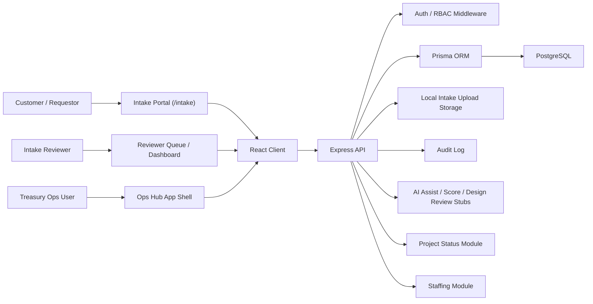

# Design Review: Treasury Operations Hub

**Status:** Draft for CIO / AI Engineering review  
**Prepared for:** Treasury CIO Sam Corcos and Treasury CIO AI Engineer team  
**Prepared by:** Matt Stevenson  
**Date:** 2026-04-23  
**Decision requested:** Approve Treasury CIO AI Engineering to host and productionize this application, starting with Intake.

---

## Executive Summary

Treasury Operations Hub replaces fragmented tracking in Excel, SharePoint, and ServiceNow with one internal workflow for Intake, Project Status, and Staffing.

The recommended first production scope is **Intake**. That is the right wedge because CIO Engineering already wants a better intake process, and this application already has the core workflow: customer submissions, reviewer queue, AI extension points, determinations, version history, attachments, audit logging, and conversion of approved requests into project records.

This is a small, workable application, not a multi-month build. My prediction is that it can be productionized in **1 week** with **minimal engineer support**: one AI/platform engineer for hosting, auth, and AI wiring, plus light Treasury Operations support for validation.

This recommendation fits Sam Corcos's visible priorities: cut legacy process overhead, reduce dependency on slow contractor-heavy workflows, and let engineers ship a practical improvement quickly. Public reporting has described Corcos as Treasury CIO with emphasis on modernization, O&M cost pressure, complexity reduction, and stronger engineering execution. Sources: [FedScoop, 2025-05-06](https://fedscoop.com/doge-sam-corcos-treasury-chief-information-officer/), [Reuters via Investing.com, 2025-03-20](https://www.investing.com/news/economy-news/trump-doge-executive-claims-15-billion-savings-from-irs-technology-budget-3940999), [Federal News Network, 2025-10-21](https://federalnewsnetwork.com/workforce/2025/10/treasury-cio-says-irs-it-layoffs-are-painful-but-necessary-for-reorganization/).

## Background

Treasury Operations currently tracks work across outdated and disconnected tools: Excel files, SharePoint artifacts, and ServiceNow records. That creates duplicate entry, weak prioritization, and poor visibility across intake, execution status, and staffing.

Treasury Operations Hub has three parts:

| Area | Purpose | Production priority |
|---|---|---|
| Intake | Capture, review, score, decide, and convert work requests | First |
| Project Status | Track program/application/project health, updates, issues, accomplishments, roadmap, and executive rollup | Second |
| Staffing | Track people, assignments, resource requests, utilization, and contractor POP visibility | Supporting |

The application is already built far enough to justify ownership. The repository includes a React client, Express API, Prisma data model, PostgreSQL-ready schema, Docker Compose, role-based UI gates, audit logging, document upload, notification models, and seeded/reference data flows.

## Goals

| Goal | Success measure |
|---|---|
| Replace informal intake tracking | New requests are submitted through the app instead of Excel, SharePoint, or ad hoc ServiceNow records. |
| Give CIO Engineering a usable intake queue | Reviewers can see submitted requests, search/filter them, score them, and make determinations. |
| Convert approved work into project tracking | Approved intake creates a `StatusProject` in `initiated` state. |
| Keep first release small | Production Intake can launch in 1 week without broad enterprise workflow redesign. |
| Preserve Treasury Operations value | Status and Staffing remain available for Treasury Operations without blocking Intake rollout. |

## Non-Goals

| Non-goal | Reason |
|---|---|
| Replace all ServiceNow functions | This app replaces lightweight tracking and prioritization, not enterprise ITSM. |
| Build a full PPM suite | The app should remain small and opinionated. |
| Centralize sensitive taxpayer data | Intake should store project/request metadata and supporting docs only. |
| Redesign Treasury-wide authentication | Use the approved internal auth path; do not invent a parallel identity system. |

## Current Design

### Architecture

### Core Components

| Component | Evidence in repo | Notes |
|---|---|---|
| Client | `client/src/App.tsx` | React routes for Intake, Status, Staffing, Admin, Notifications. |
| Server | `server/src/index.ts`, `server/src/routes/*` | Express API with modular route files. |
| Database | `server/prisma/schema.prisma` | Prisma schema for users, intake, status, staffing, notifications, audit. |
| Intake API | `server/src/routes/intake.ts` | Drafts, submissions, versions, docs, reviewer queue, scoring, determinations, design review generation. |
| Intake UI | `client/src/pages/intake/*` | Customer portal and reviewer screens. |
| Hosting scaffold | `docker-compose.yml`, Dockerfiles | Existing local containerization path. |

## Intake First

Intake should be the first hosted slice because it is the narrowest, highest-value workflow:

| Intake capability | Why it matters |
|---|---|
| Customer portal isolated from Ops Hub chrome | Requestors can submit without getting broader operational access. |
| Draft and submitted states | Supports realistic request creation before review. |
| Versioned form data | Keeps history as submissions evolve. |
| Reviewer queue and dashboard | Gives CIO Engineering an operational intake surface immediately. |
| AI assist / score / design review extension points | Lets AI Engineering add value without reworking the app. |
| Determination workflow | Supports backlog, denial, and approval decisions. |
| Approval creates project | Bridges intake to execution without duplicate entry. |

This is a strong first AI Engineering ownership candidate because the AI surface area is clear and bounded: assist requestors, score and triage submissions, and draft a design review from structured intake data.

## Detailed Design

### Intake Data Model

| Model | Responsibility |
|---|---|
| `IntakeSubmission` | Request lifecycle, submitter, status, determination, AI score, linked project, generated design review markdown. |
| `IntakeSubmissionVersion` | Versioned JSON form data. |
| `IntakeDocument` | Uploaded supporting documents with metadata and storage path. |
| `User` extensions | `userType`, `isIntakeReviewer`, role-based access. |

### Intake API Surface

| API area | Examples |
|---|---|
| Customer | Create draft, update draft, submit, list my submissions, upload/download/delete docs. |
| Reviewer | List all submissions, dashboard stats, score, determine, generate/download design review. |
| Access control | Submitters can access their own submissions; reviewers/admins can access reviewer functions. |
| Audit | Create, update, submit, determine, upload, delete, and design-review actions are logged. |

### AI Integration Points

The app currently includes AI stubs. That is useful here because AI can be wired in without redesigning the workflow.

| AI function | Current state | Production version |
|---|---|---|
| Requestor assist | API/UI exists | Connect to approved LLM endpoint with prompt guardrails. |
| Reviewer scoring | Stored score/details exist | Use rubric-based score with visible rationale for reviewers only. |
| Design review drafting | Markdown generator exists | Generate CIO-ready design review from intake fields and documents. |

## Implementation Plan

Assumption: approval is granted by Friday, 2026-04-24.

| Date | Milestone | Exit criteria |
|---|---|---|
| Mon 2026-04-27 | Production target selected | Hosting environment, URL, database, secrets, and auth path confirmed. |
| Tue 2026-04-28 | Intake production hardening | Auth wired, env config set, file storage decision made, smoke tests passing. |
| Wed 2026-04-29 | AI integration | Assist/score/design-review endpoints call approved model or are explicitly feature-flagged. |
| Thu 2026-04-30 | UAT | Treasury Ops and CIO Engineering validate sample intake from submit to determination, including attachments. |
| Fri 2026-05-01 | Launch | Intake available to pilot users, runbook created, rollback path documented. |

## Resource Requirements

My prediction is:

| Role | Time | Responsibility |
|---|---:|---|
| AI/platform engineer | 3-5 days | Hosting, auth, env/secrets, AI endpoint wiring, production deployment. |
| Treasury Ops product owner | 2-4 hours total | Validate fields, workflow, reviewer roles, pilot users. |
| Security/platform reviewer | 1-2 hours | Confirm hosting/auth/logging/storage posture. |
| Matt Stevenson | As needed during week | App walkthrough, workflow validation, acceptance testing, backlog triage. |

This does not require a large project team. Most of the work is deployment, integration, and tightening, not net-new application development.

## Testing Strategy

| Test area | Required before launch |
|---|---|
| Smoke | Login, create draft, update draft, upload doc, submit, review, determine, create project. |
| Access control | Customer cannot see reviewer queue; reviewer can see submitted requests; submitter cannot see AI score. |
| Regression | Status and Staffing routes still load after Intake production config. |
| AI | AI calls are logged, bounded, and fail gracefully; no raw sensitive docs are sent unless approved. |
| Data | Approved intake creates exactly one linked project. |

## Deployment Strategy

Preferred deployment is a small internal hosted app:

| Layer | Recommendation |
|---|---|
| Client | Static React build behind Treasury-approved access controls. |
| API | Node/Express service. |
| Database | Managed PostgreSQL or approved internal Postgres. |
| Files | Attachments are enabled at launch; use approved durable storage if available, or explicitly accept a short pilot on local storage with a migration plan. |
| Secrets | Use platform secret manager, not repo/env files. |
| Rollback | Keep previous container/image available; database migrations should be reviewed before launch. |

## Operations

| Operational need | Recommendation |
|---|---|
| Monitoring | API health endpoint, app availability, error rate, request latency. |
| Audit | Retain audit logs for intake lifecycle events. |
| Alerts | Page/notify on app down, database unavailable, failed auth integration, failed AI endpoint. |
| Runbook | Document restart, rollback, migration, user-role update, and AI feature-flag procedures. |
| Ownership | CIO AI Engineering owns hosted app health; Treasury Operations owns workflow/content. |

## Risks

| Risk | Severity | Mitigation | Owner |
|---|---|---|---|
| Auth path is not production-ready | High | Confirm approved Treasury auth integration before launch. | CIO AI Engineering |
| AI endpoints are still stubs | Medium | Launch Intake with AI feature flag if needed; wire AI during same week if endpoint is available. | CIO AI Engineering |
| File storage is local disk | Medium | Attachments are in scope for launch, so either use durable approved storage or accept a short pilot on current storage with a documented migration path. | Platform engineer |
| Scope expands into a full PPM replacement effort | Medium | Keep first release Intake-only; Status and Staffing remain supporting modules. | Product owner |
| Data sensitivity unclear | Medium | Define allowed submission/document content before pilot. | Security/platform reviewer |
| No mature automated test suite | Low | Use smoke-test checklist for launch; add e2e tests after pilot. | App owner |

## Alternatives Considered

| Alternative | Pros | Cons | Recommendation |
|---|---|---|---|
| Keep Excel/SharePoint/ServiceNow | No new hosting required | Fragmented, slow, weak visibility, no AI workflow, duplicate entry, no single owner | Reject |
| Build a new intake app from scratch | Clean slate | Slower, duplicates existing working code | Reject |
| Adopt Treasury Operations Hub Intake first | Fast, focused, already implemented | Needs hosting/auth/AI hardening | Choose |
| Adopt all three modules immediately | Higher total value | More scope and review burden | Defer; keep available but do not make it launch blocker |

## Critical Gaps

These should be resolved before production launch:

| Gap | Needed decision |
|---|---|
| Production auth | Which Treasury identity/auth mechanism should replace or back the current app login? |
| Hosting target | Where should the app run, and who owns uptime? |
| AI endpoint | Which approved model/API should power assist, scoring, and design-review generation? |
| File storage | Attachments are enabled at launch; confirm the approved storage location. |
| Pilot population | Confirm first rollout user group and reviewer assignment model, even if named reviewers are not finalized yet. |
| Data policy | What content is prohibited from Intake submissions/documents? |
| Intake scoring rubric | CIO Engineering should define the intake prioritization/scoring rubric as part of ownership. |

## Open Questions for Matt / Stakeholders

1. Who approves final intake prioritization when reviewer recommendations differ?
2. What content is prohibited from Intake submissions/documents?
3. What is the approved production auth path?
4. What is the approved hosting/storage target for launch attachments?

## Approval

Approval requested:

| Approver | Decision |
|---|---|
| Treasury CIO / delegate | Approve CIO AI Engineering to host and productionize Intake-first release. |
| Treasury Operations owner | Approve pilot workflow and fields. |
| Platform/security reviewer | Approve auth, hosting, logging, storage, and AI data handling. |

Recommended decision: **approve a 1-week Intake-first productionization effort**. It is the fastest path to replacing a messy intake process with something owned, auditable, and extensible, without creating a large new engineering commitment.

## Confirmed Scope Decisions

| Decision | Outcome |
|---|---|
| Intake reviewers named for pilot | Not yet defined; does not block approval. |
| Attachments at launch | Enabled. |
| Approved intake creates staffing demand | No; approved intake creates only a Project Status record for now. |
| Authority of replaced ServiceNow/SharePoint workflows after launch | None; workflows replaced by this app should no longer be authoritative. |
| Intake prioritization rubric | CIO Engineering owns definition of the rubric. |
